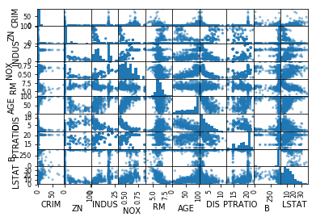
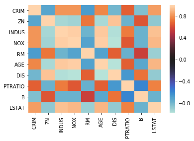

# Multicollinearity of Features - Lab

## Introduction

In this lab you'll identify multicollinearity in the Boston Housing Data set.

## Objectives
You will be able to:
* Plot heatmaps for the predictors of the Boston dataset
* Understand and calculate correlation matrices

## Correlation matrix for the Boston Housing data

Let's reimport the Boston Housing data and let's use the data with the categorical variables for `tax_dummy` and `rad_dummy`


```python
import pandas as pd
from sklearn.datasets import load_boston
%matplotlib inline
boston = load_boston()

boston_features = pd.DataFrame(boston.data, columns = boston.feature_names)

# first, create bins for based on the values observed. 5 values will result in 4 bins
bins = [0, 3, 4 , 5, 24]
bins_rad = pd.cut(boston_features['RAD'], bins)
bins_rad = bins_rad.cat.as_unordered()

# first, create bins for based on the values observed. 5 values will result in 4 bins
bins = [0, 250, 300, 360, 460, 712]
bins_tax = pd.cut(boston_features['TAX'], bins)
bins_tax = bins_tax.cat.as_unordered()

tax_dummy = pd.get_dummies(bins_tax, prefix="TAX")
rad_dummy = pd.get_dummies(bins_rad, prefix="RAD")
boston_features = boston_features.drop(["RAD","TAX"], axis=1)
boston_features = pd.concat([boston_features, rad_dummy, tax_dummy], axis=1)
```


```python
boston_features.head()
```


<div>
<style scoped>
    .dataframe tbody tr th:only-of-type {
        vertical-align: middle;
    }

    .dataframe tbody tr th {
        vertical-align: top;
    }

    .dataframe thead th {
        text-align: right;
    }
</style>
<table border="1" class="dataframe">
  <thead>
    <tr style="text-align: right;">
      <th></th>
      <th>CRIM</th>
      <th>ZN</th>
      <th>INDUS</th>
      <th>CHAS</th>
      <th>NOX</th>
      <th>RM</th>
      <th>AGE</th>
      <th>DIS</th>
      <th>PTRATIO</th>
      <th>B</th>
      <th>LSTAT</th>
      <th>RAD_(0, 3]</th>
      <th>RAD_(3, 4]</th>
      <th>RAD_(4, 5]</th>
      <th>RAD_(5, 24]</th>
      <th>TAX_(0, 250]</th>
      <th>TAX_(250, 300]</th>
      <th>TAX_(300, 360]</th>
      <th>TAX_(360, 460]</th>
      <th>TAX_(460, 712]</th>
    </tr>
  </thead>
  <tbody>
    <tr>
      <th>0</th>
      <td>0.00632</td>
      <td>18.0</td>
      <td>2.31</td>
      <td>0.0</td>
      <td>0.538</td>
      <td>6.575</td>
      <td>65.2</td>
      <td>4.0900</td>
      <td>15.3</td>
      <td>396.90</td>
      <td>4.98</td>
      <td>1</td>
      <td>0</td>
      <td>0</td>
      <td>0</td>
      <td>0</td>
      <td>1</td>
      <td>0</td>
      <td>0</td>
      <td>0</td>
    </tr>
    <tr>
      <th>1</th>
      <td>0.02731</td>
      <td>0.0</td>
      <td>7.07</td>
      <td>0.0</td>
      <td>0.469</td>
      <td>6.421</td>
      <td>78.9</td>
      <td>4.9671</td>
      <td>17.8</td>
      <td>396.90</td>
      <td>9.14</td>
      <td>1</td>
      <td>0</td>
      <td>0</td>
      <td>0</td>
      <td>1</td>
      <td>0</td>
      <td>0</td>
      <td>0</td>
      <td>0</td>
    </tr>
    <tr>
      <th>2</th>
      <td>0.02729</td>
      <td>0.0</td>
      <td>7.07</td>
      <td>0.0</td>
      <td>0.469</td>
      <td>7.185</td>
      <td>61.1</td>
      <td>4.9671</td>
      <td>17.8</td>
      <td>392.83</td>
      <td>4.03</td>
      <td>1</td>
      <td>0</td>
      <td>0</td>
      <td>0</td>
      <td>1</td>
      <td>0</td>
      <td>0</td>
      <td>0</td>
      <td>0</td>
    </tr>
    <tr>
      <th>3</th>
      <td>0.03237</td>
      <td>0.0</td>
      <td>2.18</td>
      <td>0.0</td>
      <td>0.458</td>
      <td>6.998</td>
      <td>45.8</td>
      <td>6.0622</td>
      <td>18.7</td>
      <td>394.63</td>
      <td>2.94</td>
      <td>1</td>
      <td>0</td>
      <td>0</td>
      <td>0</td>
      <td>1</td>
      <td>0</td>
      <td>0</td>
      <td>0</td>
      <td>0</td>
    </tr>
    <tr>
      <th>4</th>
      <td>0.06905</td>
      <td>0.0</td>
      <td>2.18</td>
      <td>0.0</td>
      <td>0.458</td>
      <td>7.147</td>
      <td>54.2</td>
      <td>6.0622</td>
      <td>18.7</td>
      <td>396.90</td>
      <td>5.33</td>
      <td>1</td>
      <td>0</td>
      <td>0</td>
      <td>0</td>
      <td>1</td>
      <td>0</td>
      <td>0</td>
      <td>0</td>
      <td>0</td>
    </tr>
  </tbody>
</table>
</div>


## Scatter matrix

Create the scatter matrix for the Boston Housing data.


```python
pd.plotting.scatter_matrix(boston_features[['CRIM', 'ZN', 'INDUS', 'NOX', 
                                            'RM', 'AGE', 'DIS', 'PTRATIO',
                                           'B', 'LSTAT']])
```


    array([[<matplotlib.axes._subplots.AxesSubplot object at 0x7fad4401a588>,
            <matplotlib.axes._subplots.AxesSubplot object at 0x7fad215c5160>,
            <matplotlib.axes._subplots.AxesSubplot object at 0x7fad519baf60>,
            <matplotlib.axes._subplots.AxesSubplot object at 0x7fad83a1f128>,
            <matplotlib.axes._subplots.AxesSubplot object at 0x7fad926bb908>,
            <matplotlib.axes._subplots.AxesSubplot object at 0x7fad92684b70>,
            <matplotlib.axes._subplots.AxesSubplot object at 0x7fad83e90dd8>,
            <matplotlib.axes._subplots.AxesSubplot object at 0x7fad83e950b8>,
            <matplotlib.axes._subplots.AxesSubplot object at 0x7fad83e950f0>,
            <matplotlib.axes._subplots.AxesSubplot object at 0x7fad83eac550>],
           [<matplotlib.axes._subplots.AxesSubplot object at 0x7fad83eb77b8>,
            <matplotlib.axes._subplots.AxesSubplot object at 0x7fad51adba20>,
            <matplotlib.axes._subplots.AxesSubplot object at 0x7fad51ae8c88>,
            <matplotlib.axes._subplots.AxesSubplot object at 0x7fad51afeef0>,
            <matplotlib.axes._subplots.AxesSubplot object at 0x7fad718dd198>,
            <matplotlib.axes._subplots.AxesSubplot object at 0x7fad71903400>,
            <matplotlib.axes._subplots.AxesSubplot object at 0x7fad217b2668>,
            <matplotlib.axes._subplots.AxesSubplot object at 0x7fad217d38d0>,
            <matplotlib.axes._subplots.AxesSubplot object at 0x7fad83d94b38>,
            <matplotlib.axes._subplots.AxesSubplot object at 0x7fad83db7da0>],
           [<matplotlib.axes._subplots.AxesSubplot object at 0x7fad926e6048>,
            <matplotlib.axes._subplots.AxesSubplot object at 0x7fad83dbe2b0>,
            <matplotlib.axes._subplots.AxesSubplot object at 0x7fad83de2518>,
            <matplotlib.axes._subplots.AxesSubplot object at 0x7fad83f3a780>,
            <matplotlib.axes._subplots.AxesSubplot object at 0x7fad83f5c9e8>,
            <matplotlib.axes._subplots.AxesSubplot object at 0x7fad83f7dc50>,
            <matplotlib.axes._subplots.AxesSubplot object at 0x7fad83f9feb8>,
            <matplotlib.axes._subplots.AxesSubplot object at 0x7fad83fc5160>,
            <matplotlib.axes._subplots.AxesSubplot object at 0x7fad83fea5f8>,
            <matplotlib.axes._subplots.AxesSubplot object at 0x7fad84014b70>],
           [<matplotlib.axes._subplots.AxesSubplot object at 0x7fad84043128>,
            <matplotlib.axes._subplots.AxesSubplot object at 0x7fad8406d6a0>,
            <matplotlib.axes._subplots.AxesSubplot object at 0x7fad84093c18>,
            <matplotlib.axes._subplots.AxesSubplot object at 0x7fad840c61d0>,
            <matplotlib.axes._subplots.AxesSubplot object at 0x7fad840ef748>,
            <matplotlib.axes._subplots.AxesSubplot object at 0x7fad84115cc0>,
            <matplotlib.axes._subplots.AxesSubplot object at 0x7fad84147278>,
            <matplotlib.axes._subplots.AxesSubplot object at 0x7fad8416f7f0>,
            <matplotlib.axes._subplots.AxesSubplot object at 0x7fad51b38d68>,
            <matplotlib.axes._subplots.AxesSubplot object at 0x7fad51b69320>],
           [<matplotlib.axes._subplots.AxesSubplot object at 0x7fad51b8c898>,
            <matplotlib.axes._subplots.AxesSubplot object at 0x7fad51bb8e10>,
            <matplotlib.axes._subplots.AxesSubplot object at 0x7fad51be93c8>,
            <matplotlib.axes._subplots.AxesSubplot object at 0x7fad51c0e940>,
            <matplotlib.axes._subplots.AxesSubplot object at 0x7fad51c39eb8>,
            <matplotlib.axes._subplots.AxesSubplot object at 0x7fad9271a470>,
            <matplotlib.axes._subplots.AxesSubplot object at 0x7fad927419e8>,
            <matplotlib.axes._subplots.AxesSubplot object at 0x7fad9276af60>,
            <matplotlib.axes._subplots.AxesSubplot object at 0x7fad9279c518>,
            <matplotlib.axes._subplots.AxesSubplot object at 0x7fad927c2a90>],
           [<matplotlib.axes._subplots.AxesSubplot object at 0x7fad927cb048>,
            <matplotlib.axes._subplots.AxesSubplot object at 0x7fad9281c5c0>,
            <matplotlib.axes._subplots.AxesSubplot object at 0x7fad84171b38>,
            <matplotlib.axes._subplots.AxesSubplot object at 0x7fad841a40f0>,
            <matplotlib.axes._subplots.AxesSubplot object at 0x7fad841cb668>,
            <matplotlib.axes._subplots.AxesSubplot object at 0x7fad841f4be0>,
            <matplotlib.axes._subplots.AxesSubplot object at 0x7fad84225198>,
            <matplotlib.axes._subplots.AxesSubplot object at 0x7fad8424b710>,
            <matplotlib.axes._subplots.AxesSubplot object at 0x7fad84277c88>,
            <matplotlib.axes._subplots.AxesSubplot object at 0x7fad842a6240>],
           [<matplotlib.axes._subplots.AxesSubplot object at 0x7fad4413f7b8>,
            <matplotlib.axes._subplots.AxesSubplot object at 0x7fad44167d30>,
            <matplotlib.axes._subplots.AxesSubplot object at 0x7fad441972e8>,
            <matplotlib.axes._subplots.AxesSubplot object at 0x7fad71927860>,
            <matplotlib.axes._subplots.AxesSubplot object at 0x7fad71952dd8>,
            <matplotlib.axes._subplots.AxesSubplot object at 0x7fad71982390>,
            <matplotlib.axes._subplots.AxesSubplot object at 0x7fad719a7908>,
            <matplotlib.axes._subplots.AxesSubplot object at 0x7fad719d1e80>,
            <matplotlib.axes._subplots.AxesSubplot object at 0x7fad71a01438>,
            <matplotlib.axes._subplots.AxesSubplot object at 0x7fad71a289b0>],
           [<matplotlib.axes._subplots.AxesSubplot object at 0x7fad71a50f28>,
            <matplotlib.axes._subplots.AxesSubplot object at 0x7fad71a824e0>,
            <matplotlib.axes._subplots.AxesSubplot object at 0x7fad71aaaa58>,
            <matplotlib.axes._subplots.AxesSubplot object at 0x7fad71ad2fd0>,
            <matplotlib.axes._subplots.AxesSubplot object at 0x7fad71b03588>,
            <matplotlib.axes._subplots.AxesSubplot object at 0x7fad71b2bb00>,
            <matplotlib.axes._subplots.AxesSubplot object at 0x7fad71b5c0b8>,
            <matplotlib.axes._subplots.AxesSubplot object at 0x7fad71b85630>,
            <matplotlib.axes._subplots.AxesSubplot object at 0x7fad71bacba8>,
            <matplotlib.axes._subplots.AxesSubplot object at 0x7fad71bdd160>],
           [<matplotlib.axes._subplots.AxesSubplot object at 0x7fad71c046d8>,
            <matplotlib.axes._subplots.AxesSubplot object at 0x7fad71c2cc50>,
            <matplotlib.axes._subplots.AxesSubplot object at 0x7fad71c5d208>,
            <matplotlib.axes._subplots.AxesSubplot object at 0x7fad71c86780>,
            <matplotlib.axes._subplots.AxesSubplot object at 0x7fad71cafcf8>,
            <matplotlib.axes._subplots.AxesSubplot object at 0x7fad71cde2b0>,
            <matplotlib.axes._subplots.AxesSubplot object at 0x7fad71d05828>,
            <matplotlib.axes._subplots.AxesSubplot object at 0x7fad71d30da0>,
            <matplotlib.axes._subplots.AxesSubplot object at 0x7fad71d60358>,
            <matplotlib.axes._subplots.AxesSubplot object at 0x7fad71d8a8d0>],
           [<matplotlib.axes._subplots.AxesSubplot object at 0x7fad71db1e48>,
            <matplotlib.axes._subplots.AxesSubplot object at 0x7fad83e41e80>,
            <matplotlib.axes._subplots.AxesSubplot object at 0x7fad92865438>,
            <matplotlib.axes._subplots.AxesSubplot object at 0x7fad217e49b0>,
            <matplotlib.axes._subplots.AxesSubplot object at 0x7fad2180ef28>,
            <matplotlib.axes._subplots.AxesSubplot object at 0x7fad441c74e0>,
            <matplotlib.axes._subplots.AxesSubplot object at 0x7fad9288ea58>,
            <matplotlib.axes._subplots.AxesSubplot object at 0x7fad928b8fd0>,
            <matplotlib.axes._subplots.AxesSubplot object at 0x7fad30078588>,
            <matplotlib.axes._subplots.AxesSubplot object at 0x7fad71dd6b00>]],
          dtype=object)





This took a while to load. Not surprisingly, the categorical variables didn't really provide any meaningful result. remove the categorical columns associated with "RAD" and "TAX" from the data again and look at the scatter matrix again.


```python

```

## Correlation matrix

Next, let's look at the correlation matrix


```python
boston_numerical_features = boston_features[['CRIM', 'ZN', 'INDUS', 'NOX', 
                                            'RM', 'AGE', 'DIS', 'PTRATIO',
                                           'B', 'LSTAT']]
boston_numerical_features.corr()
```


<div>
<style scoped>
    .dataframe tbody tr th:only-of-type {
        vertical-align: middle;
    }

    .dataframe tbody tr th {
        vertical-align: top;
    }

    .dataframe thead th {
        text-align: right;
    }
</style>
<table border="1" class="dataframe">
  <thead>
    <tr style="text-align: right;">
      <th></th>
      <th>CRIM</th>
      <th>ZN</th>
      <th>INDUS</th>
      <th>NOX</th>
      <th>RM</th>
      <th>AGE</th>
      <th>DIS</th>
      <th>PTRATIO</th>
      <th>B</th>
      <th>LSTAT</th>
    </tr>
  </thead>
  <tbody>
    <tr>
      <th>CRIM</th>
      <td>1.000000</td>
      <td>-0.200469</td>
      <td>0.406583</td>
      <td>0.420972</td>
      <td>-0.219247</td>
      <td>0.352734</td>
      <td>-0.379670</td>
      <td>0.289946</td>
      <td>-0.385064</td>
      <td>0.455621</td>
    </tr>
    <tr>
      <th>ZN</th>
      <td>-0.200469</td>
      <td>1.000000</td>
      <td>-0.533828</td>
      <td>-0.516604</td>
      <td>0.311991</td>
      <td>-0.569537</td>
      <td>0.664408</td>
      <td>-0.391679</td>
      <td>0.175520</td>
      <td>-0.412995</td>
    </tr>
    <tr>
      <th>INDUS</th>
      <td>0.406583</td>
      <td>-0.533828</td>
      <td>1.000000</td>
      <td>0.763651</td>
      <td>-0.391676</td>
      <td>0.644779</td>
      <td>-0.708027</td>
      <td>0.383248</td>
      <td>-0.356977</td>
      <td>0.603800</td>
    </tr>
    <tr>
      <th>NOX</th>
      <td>0.420972</td>
      <td>-0.516604</td>
      <td>0.763651</td>
      <td>1.000000</td>
      <td>-0.302188</td>
      <td>0.731470</td>
      <td>-0.769230</td>
      <td>0.188933</td>
      <td>-0.380051</td>
      <td>0.590879</td>
    </tr>
    <tr>
      <th>RM</th>
      <td>-0.219247</td>
      <td>0.311991</td>
      <td>-0.391676</td>
      <td>-0.302188</td>
      <td>1.000000</td>
      <td>-0.240265</td>
      <td>0.205246</td>
      <td>-0.355501</td>
      <td>0.128069</td>
      <td>-0.613808</td>
    </tr>
    <tr>
      <th>AGE</th>
      <td>0.352734</td>
      <td>-0.569537</td>
      <td>0.644779</td>
      <td>0.731470</td>
      <td>-0.240265</td>
      <td>1.000000</td>
      <td>-0.747881</td>
      <td>0.261515</td>
      <td>-0.273534</td>
      <td>0.602339</td>
    </tr>
    <tr>
      <th>DIS</th>
      <td>-0.379670</td>
      <td>0.664408</td>
      <td>-0.708027</td>
      <td>-0.769230</td>
      <td>0.205246</td>
      <td>-0.747881</td>
      <td>1.000000</td>
      <td>-0.232471</td>
      <td>0.291512</td>
      <td>-0.496996</td>
    </tr>
    <tr>
      <th>PTRATIO</th>
      <td>0.289946</td>
      <td>-0.391679</td>
      <td>0.383248</td>
      <td>0.188933</td>
      <td>-0.355501</td>
      <td>0.261515</td>
      <td>-0.232471</td>
      <td>1.000000</td>
      <td>-0.177383</td>
      <td>0.374044</td>
    </tr>
    <tr>
      <th>B</th>
      <td>-0.385064</td>
      <td>0.175520</td>
      <td>-0.356977</td>
      <td>-0.380051</td>
      <td>0.128069</td>
      <td>-0.273534</td>
      <td>0.291512</td>
      <td>-0.177383</td>
      <td>1.000000</td>
      <td>-0.366087</td>
    </tr>
    <tr>
      <th>LSTAT</th>
      <td>0.455621</td>
      <td>-0.412995</td>
      <td>0.603800</td>
      <td>0.590879</td>
      <td>-0.613808</td>
      <td>0.602339</td>
      <td>-0.496996</td>
      <td>0.374044</td>
      <td>-0.366087</td>
      <td>1.000000</td>
    </tr>
  </tbody>
</table>
</div>


```python
boston_corr = boston_numerical_features.corr()
abs(boston_corr) > 0.75
```


<div>
<style scoped>
    .dataframe tbody tr th:only-of-type {
        vertical-align: middle;
    }

    .dataframe tbody tr th {
        vertical-align: top;
    }

    .dataframe thead th {
        text-align: right;
    }
</style>
<table border="1" class="dataframe">
  <thead>
    <tr style="text-align: right;">
      <th></th>
      <th>CRIM</th>
      <th>ZN</th>
      <th>INDUS</th>
      <th>NOX</th>
      <th>RM</th>
      <th>AGE</th>
      <th>DIS</th>
      <th>PTRATIO</th>
      <th>B</th>
      <th>LSTAT</th>
    </tr>
  </thead>
  <tbody>
    <tr>
      <th>CRIM</th>
      <td>True</td>
      <td>False</td>
      <td>False</td>
      <td>False</td>
      <td>False</td>
      <td>False</td>
      <td>False</td>
      <td>False</td>
      <td>False</td>
      <td>False</td>
    </tr>
    <tr>
      <th>ZN</th>
      <td>False</td>
      <td>True</td>
      <td>False</td>
      <td>False</td>
      <td>False</td>
      <td>False</td>
      <td>False</td>
      <td>False</td>
      <td>False</td>
      <td>False</td>
    </tr>
    <tr>
      <th>INDUS</th>
      <td>False</td>
      <td>False</td>
      <td>True</td>
      <td>True</td>
      <td>False</td>
      <td>False</td>
      <td>False</td>
      <td>False</td>
      <td>False</td>
      <td>False</td>
    </tr>
    <tr>
      <th>NOX</th>
      <td>False</td>
      <td>False</td>
      <td>True</td>
      <td>True</td>
      <td>False</td>
      <td>False</td>
      <td>True</td>
      <td>False</td>
      <td>False</td>
      <td>False</td>
    </tr>
    <tr>
      <th>RM</th>
      <td>False</td>
      <td>False</td>
      <td>False</td>
      <td>False</td>
      <td>True</td>
      <td>False</td>
      <td>False</td>
      <td>False</td>
      <td>False</td>
      <td>False</td>
    </tr>
    <tr>
      <th>AGE</th>
      <td>False</td>
      <td>False</td>
      <td>False</td>
      <td>False</td>
      <td>False</td>
      <td>True</td>
      <td>False</td>
      <td>False</td>
      <td>False</td>
      <td>False</td>
    </tr>
    <tr>
      <th>DIS</th>
      <td>False</td>
      <td>False</td>
      <td>False</td>
      <td>True</td>
      <td>False</td>
      <td>False</td>
      <td>True</td>
      <td>False</td>
      <td>False</td>
      <td>False</td>
    </tr>
    <tr>
      <th>PTRATIO</th>
      <td>False</td>
      <td>False</td>
      <td>False</td>
      <td>False</td>
      <td>False</td>
      <td>False</td>
      <td>False</td>
      <td>True</td>
      <td>False</td>
      <td>False</td>
    </tr>
    <tr>
      <th>B</th>
      <td>False</td>
      <td>False</td>
      <td>False</td>
      <td>False</td>
      <td>False</td>
      <td>False</td>
      <td>False</td>
      <td>False</td>
      <td>True</td>
      <td>False</td>
    </tr>
    <tr>
      <th>LSTAT</th>
      <td>False</td>
      <td>False</td>
      <td>False</td>
      <td>False</td>
      <td>False</td>
      <td>False</td>
      <td>False</td>
      <td>False</td>
      <td>False</td>
      <td>True</td>
    </tr>
  </tbody>
</table>
</div>


Return "True" for positive or negative correlations that are bigger than 0.75.

### comments 
"nox and indus" are highly correlated, and "nox and dis" are highly correlated. I'll remove nox so that we can still get benefits of indus and dis, and they are not correlated with each other.


```python
import seaborn as sns
sns.heatmap(boston_corr.corr(), center=0);
```





```python
boston_features.drop(columns=['NOX'], inplace=True, axis=1)
boston_features
```


<div>
<style scoped>
    .dataframe tbody tr th:only-of-type {
        vertical-align: middle;
    }

    .dataframe tbody tr th {
        vertical-align: top;
    }

    .dataframe thead th {
        text-align: right;
    }
</style>
<table border="1" class="dataframe">
  <thead>
    <tr style="text-align: right;">
      <th></th>
      <th>CRIM</th>
      <th>ZN</th>
      <th>INDUS</th>
      <th>CHAS</th>
      <th>RM</th>
      <th>AGE</th>
      <th>DIS</th>
      <th>PTRATIO</th>
      <th>B</th>
      <th>LSTAT</th>
      <th>RAD_(0, 3]</th>
      <th>RAD_(3, 4]</th>
      <th>RAD_(4, 5]</th>
      <th>RAD_(5, 24]</th>
      <th>TAX_(0, 250]</th>
      <th>TAX_(250, 300]</th>
      <th>TAX_(300, 360]</th>
      <th>TAX_(360, 460]</th>
      <th>TAX_(460, 712]</th>
    </tr>
  </thead>
  <tbody>
    <tr>
      <th>0</th>
      <td>0.00632</td>
      <td>18.0</td>
      <td>2.31</td>
      <td>0.0</td>
      <td>6.575</td>
      <td>65.2</td>
      <td>4.0900</td>
      <td>15.3</td>
      <td>396.90</td>
      <td>4.98</td>
      <td>1</td>
      <td>0</td>
      <td>0</td>
      <td>0</td>
      <td>0</td>
      <td>1</td>
      <td>0</td>
      <td>0</td>
      <td>0</td>
    </tr>
    <tr>
      <th>1</th>
      <td>0.02731</td>
      <td>0.0</td>
      <td>7.07</td>
      <td>0.0</td>
      <td>6.421</td>
      <td>78.9</td>
      <td>4.9671</td>
      <td>17.8</td>
      <td>396.90</td>
      <td>9.14</td>
      <td>1</td>
      <td>0</td>
      <td>0</td>
      <td>0</td>
      <td>1</td>
      <td>0</td>
      <td>0</td>
      <td>0</td>
      <td>0</td>
    </tr>
    <tr>
      <th>2</th>
      <td>0.02729</td>
      <td>0.0</td>
      <td>7.07</td>
      <td>0.0</td>
      <td>7.185</td>
      <td>61.1</td>
      <td>4.9671</td>
      <td>17.8</td>
      <td>392.83</td>
      <td>4.03</td>
      <td>1</td>
      <td>0</td>
      <td>0</td>
      <td>0</td>
      <td>1</td>
      <td>0</td>
      <td>0</td>
      <td>0</td>
      <td>0</td>
    </tr>
    <tr>
      <th>3</th>
      <td>0.03237</td>
      <td>0.0</td>
      <td>2.18</td>
      <td>0.0</td>
      <td>6.998</td>
      <td>45.8</td>
      <td>6.0622</td>
      <td>18.7</td>
      <td>394.63</td>
      <td>2.94</td>
      <td>1</td>
      <td>0</td>
      <td>0</td>
      <td>0</td>
      <td>1</td>
      <td>0</td>
      <td>0</td>
      <td>0</td>
      <td>0</td>
    </tr>
    <tr>
      <th>4</th>
      <td>0.06905</td>
      <td>0.0</td>
      <td>2.18</td>
      <td>0.0</td>
      <td>7.147</td>
      <td>54.2</td>
      <td>6.0622</td>
      <td>18.7</td>
      <td>396.90</td>
      <td>5.33</td>
      <td>1</td>
      <td>0</td>
      <td>0</td>
      <td>0</td>
      <td>1</td>
      <td>0</td>
      <td>0</td>
      <td>0</td>
      <td>0</td>
    </tr>
    <tr>
      <th>5</th>
      <td>0.02985</td>
      <td>0.0</td>
      <td>2.18</td>
      <td>0.0</td>
      <td>6.430</td>
      <td>58.7</td>
      <td>6.0622</td>
      <td>18.7</td>
      <td>394.12</td>
      <td>5.21</td>
      <td>1</td>
      <td>0</td>
      <td>0</td>
      <td>0</td>
      <td>1</td>
      <td>0</td>
      <td>0</td>
      <td>0</td>
      <td>0</td>
    </tr>
    <tr>
      <th>6</th>
      <td>0.08829</td>
      <td>12.5</td>
      <td>7.87</td>
      <td>0.0</td>
      <td>6.012</td>
      <td>66.6</td>
      <td>5.5605</td>
      <td>15.2</td>
      <td>395.60</td>
      <td>12.43</td>
      <td>0</td>
      <td>0</td>
      <td>1</td>
      <td>0</td>
      <td>0</td>
      <td>0</td>
      <td>1</td>
      <td>0</td>
      <td>0</td>
    </tr>
    <tr>
      <th>7</th>
      <td>0.14455</td>
      <td>12.5</td>
      <td>7.87</td>
      <td>0.0</td>
      <td>6.172</td>
      <td>96.1</td>
      <td>5.9505</td>
      <td>15.2</td>
      <td>396.90</td>
      <td>19.15</td>
      <td>0</td>
      <td>0</td>
      <td>1</td>
      <td>0</td>
      <td>0</td>
      <td>0</td>
      <td>1</td>
      <td>0</td>
      <td>0</td>
    </tr>
    <tr>
      <th>8</th>
      <td>0.21124</td>
      <td>12.5</td>
      <td>7.87</td>
      <td>0.0</td>
      <td>5.631</td>
      <td>100.0</td>
      <td>6.0821</td>
      <td>15.2</td>
      <td>386.63</td>
      <td>29.93</td>
      <td>0</td>
      <td>0</td>
      <td>1</td>
      <td>0</td>
      <td>0</td>
      <td>0</td>
      <td>1</td>
      <td>0</td>
      <td>0</td>
    </tr>
    <tr>
      <th>9</th>
      <td>0.17004</td>
      <td>12.5</td>
      <td>7.87</td>
      <td>0.0</td>
      <td>6.004</td>
      <td>85.9</td>
      <td>6.5921</td>
      <td>15.2</td>
      <td>386.71</td>
      <td>17.10</td>
      <td>0</td>
      <td>0</td>
      <td>1</td>
      <td>0</td>
      <td>0</td>
      <td>0</td>
      <td>1</td>
      <td>0</td>
      <td>0</td>
    </tr>
    <tr>
      <th>10</th>
      <td>0.22489</td>
      <td>12.5</td>
      <td>7.87</td>
      <td>0.0</td>
      <td>6.377</td>
      <td>94.3</td>
      <td>6.3467</td>
      <td>15.2</td>
      <td>392.52</td>
      <td>20.45</td>
      <td>0</td>
      <td>0</td>
      <td>1</td>
      <td>0</td>
      <td>0</td>
      <td>0</td>
      <td>1</td>
      <td>0</td>
      <td>0</td>
    </tr>
    <tr>
      <th>11</th>
      <td>0.11747</td>
      <td>12.5</td>
      <td>7.87</td>
      <td>0.0</td>
      <td>6.009</td>
      <td>82.9</td>
      <td>6.2267</td>
      <td>15.2</td>
      <td>396.90</td>
      <td>13.27</td>
      <td>0</td>
      <td>0</td>
      <td>1</td>
      <td>0</td>
      <td>0</td>
      <td>0</td>
      <td>1</td>
      <td>0</td>
      <td>0</td>
    </tr>
    <tr>
      <th>12</th>
      <td>0.09378</td>
      <td>12.5</td>
      <td>7.87</td>
      <td>0.0</td>
      <td>5.889</td>
      <td>39.0</td>
      <td>5.4509</td>
      <td>15.2</td>
      <td>390.50</td>
      <td>15.71</td>
      <td>0</td>
      <td>0</td>
      <td>1</td>
      <td>0</td>
      <td>0</td>
      <td>0</td>
      <td>1</td>
      <td>0</td>
      <td>0</td>
    </tr>
    <tr>
      <th>13</th>
      <td>0.62976</td>
      <td>0.0</td>
      <td>8.14</td>
      <td>0.0</td>
      <td>5.949</td>
      <td>61.8</td>
      <td>4.7075</td>
      <td>21.0</td>
      <td>396.90</td>
      <td>8.26</td>
      <td>0</td>
      <td>1</td>
      <td>0</td>
      <td>0</td>
      <td>0</td>
      <td>0</td>
      <td>1</td>
      <td>0</td>
      <td>0</td>
    </tr>
    <tr>
      <th>14</th>
      <td>0.63796</td>
      <td>0.0</td>
      <td>8.14</td>
      <td>0.0</td>
      <td>6.096</td>
      <td>84.5</td>
      <td>4.4619</td>
      <td>21.0</td>
      <td>380.02</td>
      <td>10.26</td>
      <td>0</td>
      <td>1</td>
      <td>0</td>
      <td>0</td>
      <td>0</td>
      <td>0</td>
      <td>1</td>
      <td>0</td>
      <td>0</td>
    </tr>
    <tr>
      <th>15</th>
      <td>0.62739</td>
      <td>0.0</td>
      <td>8.14</td>
      <td>0.0</td>
      <td>5.834</td>
      <td>56.5</td>
      <td>4.4986</td>
      <td>21.0</td>
      <td>395.62</td>
      <td>8.47</td>
      <td>0</td>
      <td>1</td>
      <td>0</td>
      <td>0</td>
      <td>0</td>
      <td>0</td>
      <td>1</td>
      <td>0</td>
      <td>0</td>
    </tr>
    <tr>
      <th>16</th>
      <td>1.05393</td>
      <td>0.0</td>
      <td>8.14</td>
      <td>0.0</td>
      <td>5.935</td>
      <td>29.3</td>
      <td>4.4986</td>
      <td>21.0</td>
      <td>386.85</td>
      <td>6.58</td>
      <td>0</td>
      <td>1</td>
      <td>0</td>
      <td>0</td>
      <td>0</td>
      <td>0</td>
      <td>1</td>
      <td>0</td>
      <td>0</td>
    </tr>
    <tr>
      <th>17</th>
      <td>0.78420</td>
      <td>0.0</td>
      <td>8.14</td>
      <td>0.0</td>
      <td>5.990</td>
      <td>81.7</td>
      <td>4.2579</td>
      <td>21.0</td>
      <td>386.75</td>
      <td>14.67</td>
      <td>0</td>
      <td>1</td>
      <td>0</td>
      <td>0</td>
      <td>0</td>
      <td>0</td>
      <td>1</td>
      <td>0</td>
      <td>0</td>
    </tr>
    <tr>
      <th>18</th>
      <td>0.80271</td>
      <td>0.0</td>
      <td>8.14</td>
      <td>0.0</td>
      <td>5.456</td>
      <td>36.6</td>
      <td>3.7965</td>
      <td>21.0</td>
      <td>288.99</td>
      <td>11.69</td>
      <td>0</td>
      <td>1</td>
      <td>0</td>
      <td>0</td>
      <td>0</td>
      <td>0</td>
      <td>1</td>
      <td>0</td>
      <td>0</td>
    </tr>
    <tr>
      <th>19</th>
      <td>0.72580</td>
      <td>0.0</td>
      <td>8.14</td>
      <td>0.0</td>
      <td>5.727</td>
      <td>69.5</td>
      <td>3.7965</td>
      <td>21.0</td>
      <td>390.95</td>
      <td>11.28</td>
      <td>0</td>
      <td>1</td>
      <td>0</td>
      <td>0</td>
      <td>0</td>
      <td>0</td>
      <td>1</td>
      <td>0</td>
      <td>0</td>
    </tr>
    <tr>
      <th>20</th>
      <td>1.25179</td>
      <td>0.0</td>
      <td>8.14</td>
      <td>0.0</td>
      <td>5.570</td>
      <td>98.1</td>
      <td>3.7979</td>
      <td>21.0</td>
      <td>376.57</td>
      <td>21.02</td>
      <td>0</td>
      <td>1</td>
      <td>0</td>
      <td>0</td>
      <td>0</td>
      <td>0</td>
      <td>1</td>
      <td>0</td>
      <td>0</td>
    </tr>
    <tr>
      <th>21</th>
      <td>0.85204</td>
      <td>0.0</td>
      <td>8.14</td>
      <td>0.0</td>
      <td>5.965</td>
      <td>89.2</td>
      <td>4.0123</td>
      <td>21.0</td>
      <td>392.53</td>
      <td>13.83</td>
      <td>0</td>
      <td>1</td>
      <td>0</td>
      <td>0</td>
      <td>0</td>
      <td>0</td>
      <td>1</td>
      <td>0</td>
      <td>0</td>
    </tr>
    <tr>
      <th>22</th>
      <td>1.23247</td>
      <td>0.0</td>
      <td>8.14</td>
      <td>0.0</td>
      <td>6.142</td>
      <td>91.7</td>
      <td>3.9769</td>
      <td>21.0</td>
      <td>396.90</td>
      <td>18.72</td>
      <td>0</td>
      <td>1</td>
      <td>0</td>
      <td>0</td>
      <td>0</td>
      <td>0</td>
      <td>1</td>
      <td>0</td>
      <td>0</td>
    </tr>
    <tr>
      <th>23</th>
      <td>0.98843</td>
      <td>0.0</td>
      <td>8.14</td>
      <td>0.0</td>
      <td>5.813</td>
      <td>100.0</td>
      <td>4.0952</td>
      <td>21.0</td>
      <td>394.54</td>
      <td>19.88</td>
      <td>0</td>
      <td>1</td>
      <td>0</td>
      <td>0</td>
      <td>0</td>
      <td>0</td>
      <td>1</td>
      <td>0</td>
      <td>0</td>
    </tr>
    <tr>
      <th>24</th>
      <td>0.75026</td>
      <td>0.0</td>
      <td>8.14</td>
      <td>0.0</td>
      <td>5.924</td>
      <td>94.1</td>
      <td>4.3996</td>
      <td>21.0</td>
      <td>394.33</td>
      <td>16.30</td>
      <td>0</td>
      <td>1</td>
      <td>0</td>
      <td>0</td>
      <td>0</td>
      <td>0</td>
      <td>1</td>
      <td>0</td>
      <td>0</td>
    </tr>
    <tr>
      <th>25</th>
      <td>0.84054</td>
      <td>0.0</td>
      <td>8.14</td>
      <td>0.0</td>
      <td>5.599</td>
      <td>85.7</td>
      <td>4.4546</td>
      <td>21.0</td>
      <td>303.42</td>
      <td>16.51</td>
      <td>0</td>
      <td>1</td>
      <td>0</td>
      <td>0</td>
      <td>0</td>
      <td>0</td>
      <td>1</td>
      <td>0</td>
      <td>0</td>
    </tr>
    <tr>
      <th>26</th>
      <td>0.67191</td>
      <td>0.0</td>
      <td>8.14</td>
      <td>0.0</td>
      <td>5.813</td>
      <td>90.3</td>
      <td>4.6820</td>
      <td>21.0</td>
      <td>376.88</td>
      <td>14.81</td>
      <td>0</td>
      <td>1</td>
      <td>0</td>
      <td>0</td>
      <td>0</td>
      <td>0</td>
      <td>1</td>
      <td>0</td>
      <td>0</td>
    </tr>
    <tr>
      <th>27</th>
      <td>0.95577</td>
      <td>0.0</td>
      <td>8.14</td>
      <td>0.0</td>
      <td>6.047</td>
      <td>88.8</td>
      <td>4.4534</td>
      <td>21.0</td>
      <td>306.38</td>
      <td>17.28</td>
      <td>0</td>
      <td>1</td>
      <td>0</td>
      <td>0</td>
      <td>0</td>
      <td>0</td>
      <td>1</td>
      <td>0</td>
      <td>0</td>
    </tr>
    <tr>
      <th>28</th>
      <td>0.77299</td>
      <td>0.0</td>
      <td>8.14</td>
      <td>0.0</td>
      <td>6.495</td>
      <td>94.4</td>
      <td>4.4547</td>
      <td>21.0</td>
      <td>387.94</td>
      <td>12.80</td>
      <td>0</td>
      <td>1</td>
      <td>0</td>
      <td>0</td>
      <td>0</td>
      <td>0</td>
      <td>1</td>
      <td>0</td>
      <td>0</td>
    </tr>
    <tr>
      <th>29</th>
      <td>1.00245</td>
      <td>0.0</td>
      <td>8.14</td>
      <td>0.0</td>
      <td>6.674</td>
      <td>87.3</td>
      <td>4.2390</td>
      <td>21.0</td>
      <td>380.23</td>
      <td>11.98</td>
      <td>0</td>
      <td>1</td>
      <td>0</td>
      <td>0</td>
      <td>0</td>
      <td>0</td>
      <td>1</td>
      <td>0</td>
      <td>0</td>
    </tr>
    <tr>
      <th>...</th>
      <td>...</td>
      <td>...</td>
      <td>...</td>
      <td>...</td>
      <td>...</td>
      <td>...</td>
      <td>...</td>
      <td>...</td>
      <td>...</td>
      <td>...</td>
      <td>...</td>
      <td>...</td>
      <td>...</td>
      <td>...</td>
      <td>...</td>
      <td>...</td>
      <td>...</td>
      <td>...</td>
      <td>...</td>
    </tr>
    <tr>
      <th>476</th>
      <td>4.87141</td>
      <td>0.0</td>
      <td>18.10</td>
      <td>0.0</td>
      <td>6.484</td>
      <td>93.6</td>
      <td>2.3053</td>
      <td>20.2</td>
      <td>396.21</td>
      <td>18.68</td>
      <td>0</td>
      <td>0</td>
      <td>0</td>
      <td>1</td>
      <td>0</td>
      <td>0</td>
      <td>0</td>
      <td>0</td>
      <td>1</td>
    </tr>
    <tr>
      <th>477</th>
      <td>15.02340</td>
      <td>0.0</td>
      <td>18.10</td>
      <td>0.0</td>
      <td>5.304</td>
      <td>97.3</td>
      <td>2.1007</td>
      <td>20.2</td>
      <td>349.48</td>
      <td>24.91</td>
      <td>0</td>
      <td>0</td>
      <td>0</td>
      <td>1</td>
      <td>0</td>
      <td>0</td>
      <td>0</td>
      <td>0</td>
      <td>1</td>
    </tr>
    <tr>
      <th>478</th>
      <td>10.23300</td>
      <td>0.0</td>
      <td>18.10</td>
      <td>0.0</td>
      <td>6.185</td>
      <td>96.7</td>
      <td>2.1705</td>
      <td>20.2</td>
      <td>379.70</td>
      <td>18.03</td>
      <td>0</td>
      <td>0</td>
      <td>0</td>
      <td>1</td>
      <td>0</td>
      <td>0</td>
      <td>0</td>
      <td>0</td>
      <td>1</td>
    </tr>
    <tr>
      <th>479</th>
      <td>14.33370</td>
      <td>0.0</td>
      <td>18.10</td>
      <td>0.0</td>
      <td>6.229</td>
      <td>88.0</td>
      <td>1.9512</td>
      <td>20.2</td>
      <td>383.32</td>
      <td>13.11</td>
      <td>0</td>
      <td>0</td>
      <td>0</td>
      <td>1</td>
      <td>0</td>
      <td>0</td>
      <td>0</td>
      <td>0</td>
      <td>1</td>
    </tr>
    <tr>
      <th>480</th>
      <td>5.82401</td>
      <td>0.0</td>
      <td>18.10</td>
      <td>0.0</td>
      <td>6.242</td>
      <td>64.7</td>
      <td>3.4242</td>
      <td>20.2</td>
      <td>396.90</td>
      <td>10.74</td>
      <td>0</td>
      <td>0</td>
      <td>0</td>
      <td>1</td>
      <td>0</td>
      <td>0</td>
      <td>0</td>
      <td>0</td>
      <td>1</td>
    </tr>
    <tr>
      <th>481</th>
      <td>5.70818</td>
      <td>0.0</td>
      <td>18.10</td>
      <td>0.0</td>
      <td>6.750</td>
      <td>74.9</td>
      <td>3.3317</td>
      <td>20.2</td>
      <td>393.07</td>
      <td>7.74</td>
      <td>0</td>
      <td>0</td>
      <td>0</td>
      <td>1</td>
      <td>0</td>
      <td>0</td>
      <td>0</td>
      <td>0</td>
      <td>1</td>
    </tr>
    <tr>
      <th>482</th>
      <td>5.73116</td>
      <td>0.0</td>
      <td>18.10</td>
      <td>0.0</td>
      <td>7.061</td>
      <td>77.0</td>
      <td>3.4106</td>
      <td>20.2</td>
      <td>395.28</td>
      <td>7.01</td>
      <td>0</td>
      <td>0</td>
      <td>0</td>
      <td>1</td>
      <td>0</td>
      <td>0</td>
      <td>0</td>
      <td>0</td>
      <td>1</td>
    </tr>
    <tr>
      <th>483</th>
      <td>2.81838</td>
      <td>0.0</td>
      <td>18.10</td>
      <td>0.0</td>
      <td>5.762</td>
      <td>40.3</td>
      <td>4.0983</td>
      <td>20.2</td>
      <td>392.92</td>
      <td>10.42</td>
      <td>0</td>
      <td>0</td>
      <td>0</td>
      <td>1</td>
      <td>0</td>
      <td>0</td>
      <td>0</td>
      <td>0</td>
      <td>1</td>
    </tr>
    <tr>
      <th>484</th>
      <td>2.37857</td>
      <td>0.0</td>
      <td>18.10</td>
      <td>0.0</td>
      <td>5.871</td>
      <td>41.9</td>
      <td>3.7240</td>
      <td>20.2</td>
      <td>370.73</td>
      <td>13.34</td>
      <td>0</td>
      <td>0</td>
      <td>0</td>
      <td>1</td>
      <td>0</td>
      <td>0</td>
      <td>0</td>
      <td>0</td>
      <td>1</td>
    </tr>
    <tr>
      <th>485</th>
      <td>3.67367</td>
      <td>0.0</td>
      <td>18.10</td>
      <td>0.0</td>
      <td>6.312</td>
      <td>51.9</td>
      <td>3.9917</td>
      <td>20.2</td>
      <td>388.62</td>
      <td>10.58</td>
      <td>0</td>
      <td>0</td>
      <td>0</td>
      <td>1</td>
      <td>0</td>
      <td>0</td>
      <td>0</td>
      <td>0</td>
      <td>1</td>
    </tr>
    <tr>
      <th>486</th>
      <td>5.69175</td>
      <td>0.0</td>
      <td>18.10</td>
      <td>0.0</td>
      <td>6.114</td>
      <td>79.8</td>
      <td>3.5459</td>
      <td>20.2</td>
      <td>392.68</td>
      <td>14.98</td>
      <td>0</td>
      <td>0</td>
      <td>0</td>
      <td>1</td>
      <td>0</td>
      <td>0</td>
      <td>0</td>
      <td>0</td>
      <td>1</td>
    </tr>
    <tr>
      <th>487</th>
      <td>4.83567</td>
      <td>0.0</td>
      <td>18.10</td>
      <td>0.0</td>
      <td>5.905</td>
      <td>53.2</td>
      <td>3.1523</td>
      <td>20.2</td>
      <td>388.22</td>
      <td>11.45</td>
      <td>0</td>
      <td>0</td>
      <td>0</td>
      <td>1</td>
      <td>0</td>
      <td>0</td>
      <td>0</td>
      <td>0</td>
      <td>1</td>
    </tr>
    <tr>
      <th>488</th>
      <td>0.15086</td>
      <td>0.0</td>
      <td>27.74</td>
      <td>0.0</td>
      <td>5.454</td>
      <td>92.7</td>
      <td>1.8209</td>
      <td>20.1</td>
      <td>395.09</td>
      <td>18.06</td>
      <td>0</td>
      <td>1</td>
      <td>0</td>
      <td>0</td>
      <td>0</td>
      <td>0</td>
      <td>0</td>
      <td>0</td>
      <td>1</td>
    </tr>
    <tr>
      <th>489</th>
      <td>0.18337</td>
      <td>0.0</td>
      <td>27.74</td>
      <td>0.0</td>
      <td>5.414</td>
      <td>98.3</td>
      <td>1.7554</td>
      <td>20.1</td>
      <td>344.05</td>
      <td>23.97</td>
      <td>0</td>
      <td>1</td>
      <td>0</td>
      <td>0</td>
      <td>0</td>
      <td>0</td>
      <td>0</td>
      <td>0</td>
      <td>1</td>
    </tr>
    <tr>
      <th>490</th>
      <td>0.20746</td>
      <td>0.0</td>
      <td>27.74</td>
      <td>0.0</td>
      <td>5.093</td>
      <td>98.0</td>
      <td>1.8226</td>
      <td>20.1</td>
      <td>318.43</td>
      <td>29.68</td>
      <td>0</td>
      <td>1</td>
      <td>0</td>
      <td>0</td>
      <td>0</td>
      <td>0</td>
      <td>0</td>
      <td>0</td>
      <td>1</td>
    </tr>
    <tr>
      <th>491</th>
      <td>0.10574</td>
      <td>0.0</td>
      <td>27.74</td>
      <td>0.0</td>
      <td>5.983</td>
      <td>98.8</td>
      <td>1.8681</td>
      <td>20.1</td>
      <td>390.11</td>
      <td>18.07</td>
      <td>0</td>
      <td>1</td>
      <td>0</td>
      <td>0</td>
      <td>0</td>
      <td>0</td>
      <td>0</td>
      <td>0</td>
      <td>1</td>
    </tr>
    <tr>
      <th>492</th>
      <td>0.11132</td>
      <td>0.0</td>
      <td>27.74</td>
      <td>0.0</td>
      <td>5.983</td>
      <td>83.5</td>
      <td>2.1099</td>
      <td>20.1</td>
      <td>396.90</td>
      <td>13.35</td>
      <td>0</td>
      <td>1</td>
      <td>0</td>
      <td>0</td>
      <td>0</td>
      <td>0</td>
      <td>0</td>
      <td>0</td>
      <td>1</td>
    </tr>
    <tr>
      <th>493</th>
      <td>0.17331</td>
      <td>0.0</td>
      <td>9.69</td>
      <td>0.0</td>
      <td>5.707</td>
      <td>54.0</td>
      <td>2.3817</td>
      <td>19.2</td>
      <td>396.90</td>
      <td>12.01</td>
      <td>0</td>
      <td>0</td>
      <td>0</td>
      <td>1</td>
      <td>0</td>
      <td>0</td>
      <td>0</td>
      <td>1</td>
      <td>0</td>
    </tr>
    <tr>
      <th>494</th>
      <td>0.27957</td>
      <td>0.0</td>
      <td>9.69</td>
      <td>0.0</td>
      <td>5.926</td>
      <td>42.6</td>
      <td>2.3817</td>
      <td>19.2</td>
      <td>396.90</td>
      <td>13.59</td>
      <td>0</td>
      <td>0</td>
      <td>0</td>
      <td>1</td>
      <td>0</td>
      <td>0</td>
      <td>0</td>
      <td>1</td>
      <td>0</td>
    </tr>
    <tr>
      <th>495</th>
      <td>0.17899</td>
      <td>0.0</td>
      <td>9.69</td>
      <td>0.0</td>
      <td>5.670</td>
      <td>28.8</td>
      <td>2.7986</td>
      <td>19.2</td>
      <td>393.29</td>
      <td>17.60</td>
      <td>0</td>
      <td>0</td>
      <td>0</td>
      <td>1</td>
      <td>0</td>
      <td>0</td>
      <td>0</td>
      <td>1</td>
      <td>0</td>
    </tr>
    <tr>
      <th>496</th>
      <td>0.28960</td>
      <td>0.0</td>
      <td>9.69</td>
      <td>0.0</td>
      <td>5.390</td>
      <td>72.9</td>
      <td>2.7986</td>
      <td>19.2</td>
      <td>396.90</td>
      <td>21.14</td>
      <td>0</td>
      <td>0</td>
      <td>0</td>
      <td>1</td>
      <td>0</td>
      <td>0</td>
      <td>0</td>
      <td>1</td>
      <td>0</td>
    </tr>
    <tr>
      <th>497</th>
      <td>0.26838</td>
      <td>0.0</td>
      <td>9.69</td>
      <td>0.0</td>
      <td>5.794</td>
      <td>70.6</td>
      <td>2.8927</td>
      <td>19.2</td>
      <td>396.90</td>
      <td>14.10</td>
      <td>0</td>
      <td>0</td>
      <td>0</td>
      <td>1</td>
      <td>0</td>
      <td>0</td>
      <td>0</td>
      <td>1</td>
      <td>0</td>
    </tr>
    <tr>
      <th>498</th>
      <td>0.23912</td>
      <td>0.0</td>
      <td>9.69</td>
      <td>0.0</td>
      <td>6.019</td>
      <td>65.3</td>
      <td>2.4091</td>
      <td>19.2</td>
      <td>396.90</td>
      <td>12.92</td>
      <td>0</td>
      <td>0</td>
      <td>0</td>
      <td>1</td>
      <td>0</td>
      <td>0</td>
      <td>0</td>
      <td>1</td>
      <td>0</td>
    </tr>
    <tr>
      <th>499</th>
      <td>0.17783</td>
      <td>0.0</td>
      <td>9.69</td>
      <td>0.0</td>
      <td>5.569</td>
      <td>73.5</td>
      <td>2.3999</td>
      <td>19.2</td>
      <td>395.77</td>
      <td>15.10</td>
      <td>0</td>
      <td>0</td>
      <td>0</td>
      <td>1</td>
      <td>0</td>
      <td>0</td>
      <td>0</td>
      <td>1</td>
      <td>0</td>
    </tr>
    <tr>
      <th>500</th>
      <td>0.22438</td>
      <td>0.0</td>
      <td>9.69</td>
      <td>0.0</td>
      <td>6.027</td>
      <td>79.7</td>
      <td>2.4982</td>
      <td>19.2</td>
      <td>396.90</td>
      <td>14.33</td>
      <td>0</td>
      <td>0</td>
      <td>0</td>
      <td>1</td>
      <td>0</td>
      <td>0</td>
      <td>0</td>
      <td>1</td>
      <td>0</td>
    </tr>
    <tr>
      <th>501</th>
      <td>0.06263</td>
      <td>0.0</td>
      <td>11.93</td>
      <td>0.0</td>
      <td>6.593</td>
      <td>69.1</td>
      <td>2.4786</td>
      <td>21.0</td>
      <td>391.99</td>
      <td>9.67</td>
      <td>1</td>
      <td>0</td>
      <td>0</td>
      <td>0</td>
      <td>0</td>
      <td>1</td>
      <td>0</td>
      <td>0</td>
      <td>0</td>
    </tr>
    <tr>
      <th>502</th>
      <td>0.04527</td>
      <td>0.0</td>
      <td>11.93</td>
      <td>0.0</td>
      <td>6.120</td>
      <td>76.7</td>
      <td>2.2875</td>
      <td>21.0</td>
      <td>396.90</td>
      <td>9.08</td>
      <td>1</td>
      <td>0</td>
      <td>0</td>
      <td>0</td>
      <td>0</td>
      <td>1</td>
      <td>0</td>
      <td>0</td>
      <td>0</td>
    </tr>
    <tr>
      <th>503</th>
      <td>0.06076</td>
      <td>0.0</td>
      <td>11.93</td>
      <td>0.0</td>
      <td>6.976</td>
      <td>91.0</td>
      <td>2.1675</td>
      <td>21.0</td>
      <td>396.90</td>
      <td>5.64</td>
      <td>1</td>
      <td>0</td>
      <td>0</td>
      <td>0</td>
      <td>0</td>
      <td>1</td>
      <td>0</td>
      <td>0</td>
      <td>0</td>
    </tr>
    <tr>
      <th>504</th>
      <td>0.10959</td>
      <td>0.0</td>
      <td>11.93</td>
      <td>0.0</td>
      <td>6.794</td>
      <td>89.3</td>
      <td>2.3889</td>
      <td>21.0</td>
      <td>393.45</td>
      <td>6.48</td>
      <td>1</td>
      <td>0</td>
      <td>0</td>
      <td>0</td>
      <td>0</td>
      <td>1</td>
      <td>0</td>
      <td>0</td>
      <td>0</td>
    </tr>
    <tr>
      <th>505</th>
      <td>0.04741</td>
      <td>0.0</td>
      <td>11.93</td>
      <td>0.0</td>
      <td>6.030</td>
      <td>80.8</td>
      <td>2.5050</td>
      <td>21.0</td>
      <td>396.90</td>
      <td>7.88</td>
      <td>1</td>
      <td>0</td>
      <td>0</td>
      <td>0</td>
      <td>0</td>
      <td>1</td>
      <td>0</td>
      <td>0</td>
      <td>0</td>
    </tr>
  </tbody>
</table>
<p>506 rows × 19 columns</p>
</div>


Remove the most problematic feature from the data.

## Summary
Good job! You've now edited the Boston Housing Data so highly correlated variables are removed. 
